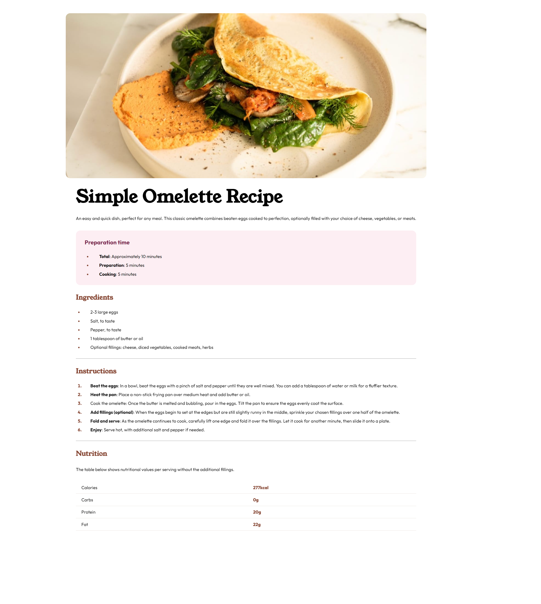

# Frontend Mentor - Recipe page solution

This is a solution to the [Recipe page challenge on Frontend Mentor](https://www.frontendmentor.io/challenges/recipe-page-KiTsR8QQKm). Frontend Mentor challenges help you improve your coding skills by building realistic projects. 

## Table of contents
  - [Screenshot](#screenshot)
  - [Built with](#built-with)
  - [What I learned](#what-i-learned)
- [Author](#author)

### Screenshot

- Live Site URL: [Add live site URL here](https://your-live-site-url.com)

### Built with

- Semantic HTML5 markup
- CSS3

### What I learned

- CSS Resets: (https://piccalil.li/blog/a-more-modern-css-reset/)
- styling lists and tables: using the li::marker class I was able to change the colour of the list points and numbers. Border-collapse property in css was a new one for me.
- Semantic HTML5 Markup

## Author

- Website - [Add your name here](https://www.your-site.com)
- Frontend Mentor - [@illusiveCode](https://www.frontendmentor.io/profile/illusiveCode)

### Thanks for reading!
